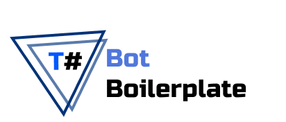

# Telegram Bot Boilerplate



Flexible, session-based and documentated console telegram bot template (boilerplate) that works on [Telegram.Bot](https://github.com/TelegramBots/Telegram.Bot) and [Entity Framework Core](https://docs.microsoft.com/ef/).

*Inspired by [grammy](https://grammy.dev/) and [telegraf](https://telegraf.js.org/)*

> #StandWithUkraine

## ⭐️ Features

- [x] session storage
- [x] complex listener & command management with validators
- [x] unit tests
- [x] built-in command argument parser
- [x] all popular databases supported *(Sqlite, MySQL, PostgreSQL, SqlServer)*
- [x] python scripts for better user experience

## 👀 Overview

Overrided Run() method should return the string that will be automatically sent to telegram user as a response.

```C#
    public class StartCommand : Command {
        public StartCommand(Bot bot): base(bot) {
            Names = new string[]{"/start", "/starting", "!start"};
        }
        public override string Run(Context context, CancellationToken cancellationToken)
        {
            return "Welcome! Press /help to see my functions.";
        }
    }
```

If the command takes some arguments, built-in argument parser will help validate and parse these arguments:

```C#
    public class EchoCommand : Command {
        public EchoCommand(Bot bot): base(bot) {
            Names = new string[]{"/echo", "!echo"};
        }
        public override string Run(Context context, CancellationToken cancellationToken)
        {
            var message = context.Update.Message;
            if (ArgumentParser.Validate(message.Text)) {
                var args = ArgumentParser.Parse(message.Text);
                return args.ArgumentsText;
            }
            return "No arguments provided.";
        }
    }
```

Example with all messages listener and session storage:

```C#
    public class MessageListener : Listener
    {
        public MessageListener(Bot bot):base(bot) {}
        public override bool Validate(Context context, CancellationToken cancellationToken)
        {
            if (context.Update.Type != UpdateType.Message)
                return false;
            return true;
        }
        public override async Task Handler(Context context, CancellationToken cancellationToken)
        {
            var session = await GetSession(context.Update.Message);
            session.Messages++;
            await SaveChanges();
        }
    }
```

## 🚩 Getting started

To use this boilerplate you need to install it via [Installation Guide](/Docs/installation.md)

## 🔧 Scripts

You can perform some complex configurations using [built-in scripts](/Scripts/README.MD).

## 📕 Guides

> Common

- [Installation Guide](https://github.com/tsziming/TelegramBotBoilerplate/wiki/Installation-Guide)
- [How to use sessions?](https://github.com/tsziming/TelegramBotBoilerplate/wiki/How-to-use-sessions%3F)
- [How to create a custom listener?](https://github.com/tsziming/TelegramBotBoilerplate/wiki/How-to-create-a-custom-listener%3F)

> About commands

- [How to create a command?](https://github.com/tsziming/TelegramBotBoilerplate/wiki/How-to-create-a-command%3F)
- [How to use command argument parser?](https://github.com/tsziming/TelegramBotBoilerplate/wiki/How-to-use-command-argument-parser%3F)


## 📝 Roadmap

- [x] Command arguments parser
- [ ] Use DI Framework for listener & command management
- [ ] Implement types for `Callback` and `Keyboard` Menus
- [ ] Generic `Context` with facade methods for basic responses
- [ ] Add i18n (bot internationalization) features
- [ ] Add webhook support
- [ ] Docker Containerization

## License

MIT - Made by [tsziming](https://github.com/tsziming)
